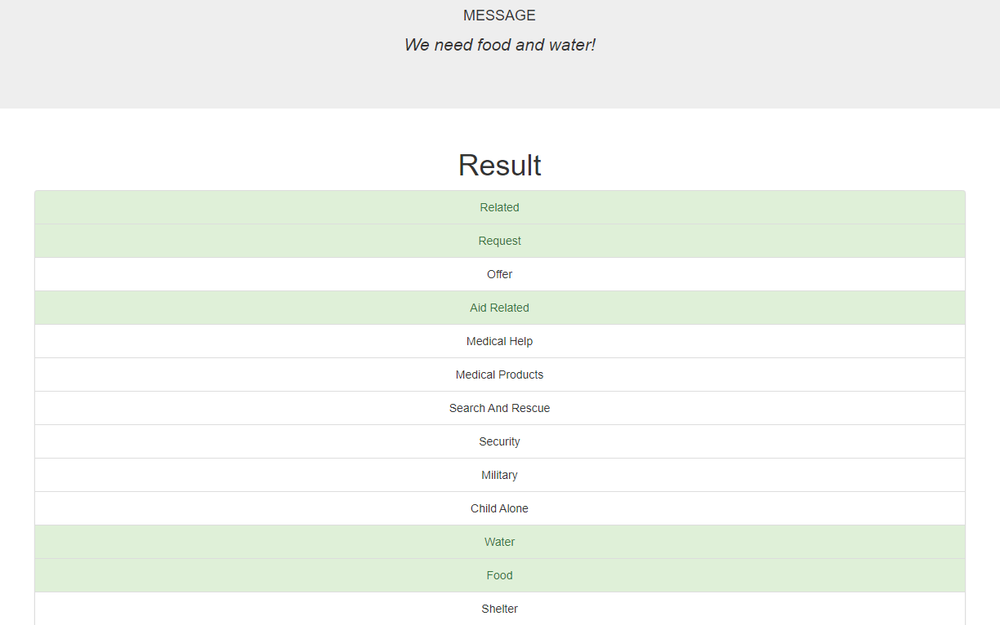
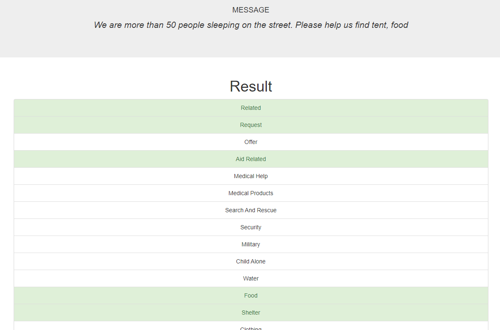

# Disaster Response Pipeline Project

### Table of Contents

1. [Install Libraries](#install)
2. [Instructions](#instructions)
3. [ETL Pipline](#etl)
4. [ML Pipeline](#ml)
5. [Web App](#webapp)

### Install Libraries

Open your terminal or command prompt and enter the following commands one by one:

For sys, re, warnings and pickle - these are built-in Python modules, so no need to install them separately.

```
pip install nltk 
pip install pandas
pip install sklearn
pip install sqlalchemy
```


### Instructions:
1. Run the following commands in the project's root directory to set up your database and model.

    - To run ETL pipeline that cleans data and stores in database
        `python data/process_data.py data/disaster_messages.csv data/disaster_categories.csv data/Disaster.db`
    - To run ML pipeline that trains classifier and saves
        `python models/train_classifier.py data/Disaster.db models/classifier.pkl`

2. Run the following command in the app's directory to run your web app.
    `python run.py`

3. Go to http://0.0.0.0:3001/


### ETL Pipeline

The ETL (Extract, Transform, Load) pipeline is implemented in the `process_data.py` file. The purpose of this pipeline is to automate the process of extracting data from the given csv files, transforming it into a clean and analyzable format, and loading it into a SQLite database for storage.

#### Detailed Workflow

Following steps outline the specific functions employed in ETL pipeline and the tasks they perform:

1. ***load_data(messages_filepath, categories_filepath):*** This function loads the data from the message and categories file paths provided as input, and returns a merged DataFrame.

2. ***clean_data(df):*** This function takes the merged DataFrame from load_data() function, cleans and processes it. It specifically splits the categories, converts category values to binary, renames category columns, merges the categories DataFrame back with the original df DataFrame and removes duplicates.

3. ***save_data(df, database_filename):*** This function saves the cleaned data returned by clean_data() function into a SQLite database specified by database_filename.

You can run the ETL pipeline with the following command:

```
python data/process_data.py data/disaster_messages.csv data/disaster_categories.csv data/Disaster.db
```

In this command, 'disaster_messages.csv' and 'disaster_categories.csv' are the input data and 'DisasterResponse.db' is the SQLite database where the cleaned data will be stored.


### ML Pipeline

The Machine Learning (ML) pipeline is encapsulated in the `train_classifier.py` file. This script accepts the file path of the database containing disaster message data and the file path to store the trained model in the form of a pickle file.

This pipeline applies Natural Language Processing (NLP) mechanisms to process, classify and predict categories of disaster messages in a multilabel classification setting, thereby using a multi-output classifier with a RandomForestClassifier. 

#### Detailed Workflow

The pipeline comprises the following key components:

1. ***load_data(database_filepath):*** This function reads the SQLite database from the given database file path and separates it into feature set X (the messages) and target set Y (the categories). It returns the text messages and category data along with category names.

2. ***tokenize(text):*** This function takes as input raw text which is then normalized, tokenized, and lemmatized to be used for training.

3. ***build_model():*** This function builds a composite pipeline model that applies feature transformations (CountVectorizer and TfidfTransformer) on the tokenized text and pairs it with the classifier. Grid search is used to explore the optimal parameters for the model.

4. ***evaluate_model(model, X_test, Y_test, category_names):*** This function applies the trained model to the test data and generates classification reports for each category to evaluate how well the model can predict message categories.

5. ***save_model(model, model_filepath):*** This function is used to save the trained model as a pickle file to the specified file path.

The classifier uses hyperparameters which are tuned using grid search. Keep in mind that the training process might take a while due to the high dimensionality of tf-idf matrices and the complexity of the RandomForest classifier.

Usage:

To use this ML pipeline, you can run the command below in the terminal:
```
python models/train_classifier.py data/Disaster.db models/classifier.pkl
```
Here, 'DisasterResponse.db' is the SQLite database containing cleaned messages and categories, and 'classifier.pkl' is the file where the trained classifier will be saved.

### Web App

The web app is built using Flask framework and is contained in the `run.py` file. The app visualizes the data and provides a user interface to classify new messages into categories. The app also displays visualizations of the training data.

To run the web app, run the following command in the app's directory:
```
python run.py
```

#### Visualizations

The web app displays three visualizations of the training data:

1. ***Distribution of Message Genres:*** This bar chart shows the distribution of messages across different genres.


2. ***Distribution of Message Categories:*** This stacked bar chart shows the distribution of messages across different categories.


3. ***Accuracy Per Category:*** This bar chart shows the accuracy of the trained classifier for each category.


The first visualization was given to me as an example.  The second and third visualizations were created by me.  What we can infer from these charts is that the accuracy is correlated to the distribution of the categories.  Some categories did not have many messages, and one category (child_alone) had no messages at all.  This is why the accuracy for that category is 0.  The accuracy for the other categories is correlated to the distribution of the messages.  The more messages a category has, the more accurate the model is at predicting that category.  This is why the accuracy for the categories with the most messages is higher than the accuracy for the categories with the least messages.

#### Classification Results

The results below are the results of the classifier from a different pickle file because that was the more accurate model.  The `classifier.pkl` file was the one that was trained on a grid search cv, but only with 50 estimators/trees in the forest.  This other pickle file was trained on 100 estimators/trees in the forest, but was not trained on a grid search cv.  This model ran longer and gave more accurate results that I wanted to showcase down below.  While running the model with the given steps will still produce results, they may not be as accurate due to the lower number of estimators/trees in the forest and the lack of data in some categories.

**Request for Food and Water**


**Request for Shelter**


### Conclusion

To recap, the Disaster Response Pipeline project presents a systematic approach to predict the appropriate category of different disaster messages. The project workflow involves an ETL pipeline to clean and load data, a machine learning pipeline to apply NLP to text message data and train a Random Forest Classifier, and a web application to classify new text messages and visualize the classified data.

The efficiency of the random forest classifier changes depending on the number and diversity of messages available in each category. The more messages a category has, the more the model learns and the higher the accuracy rate. As such, the classifier's performance could be improved by getting more messages in relatively underrepresented categories. 

Furthermore, the decision to use a lower number of estimators in Grid Search CV, for faster modeling, results in a trade-off with accuracy. As computing power increases over time, it may be feasible to run models with higher numbers of estimators without sacrificing time. 

Additionally, this pipeline can be continuously refined by experimenting with different types of classifiers, optimising hyperparameters, and incorporating advanced text processing and feature extraction techniques. 

In conclusion, this project serves as a fine example of how machine learning and data engineering can be used to classify text messages and allocate resources during a disaster. It paints a clear picture of